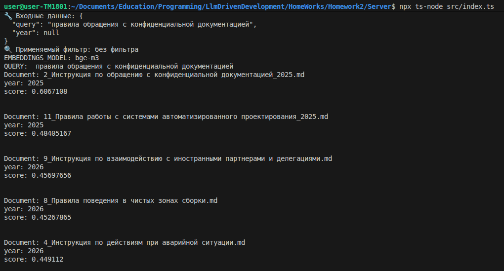
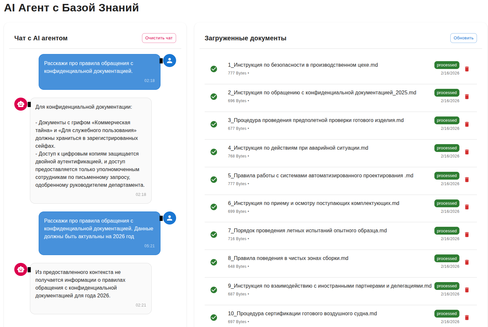

**AI-агент с базой знаний, клиентским React-приложением и сервером Express**


## Описание проекта

Этот репозиторий содержит AI-агент с базой знаний, включающий:
- **Клиентское React-приложение** (папка `Client`)
- **Сервер на Express Typescript** (папка `Server`) с реализацией агента на **LangChain/LangGraph** и **RAG**
- **Docker-инфраструктуру** для быстрого развертывания


## Возможности

✅ **AI-агент** на базе LangChain/LangGraph
✅ **RAG (Retrieval-Augmented Generation)** с векторным хранилищем Qdrant
✅ **Docker-контейнеризация** для легкого развертывания
✅ **Поддержка GPU** для Ollama

---

## Требования

- Docker и Docker Compose
- NVIDIA Container Toolkit (для GPU)
- Node.js

---

## Установка и запуск

1. **Клонируйте репозиторий:**
   ```bash
   git clone https://github.com/skorogod/rag-with-documents.git
   cd rag-with-documents
   ```

2. **Создайте `.env` файл на основе `.env.example`**

3. **Запустите проект:**
   ```bash
   docker-compose up --build
   ```

3. **Создайти и пнримените миграции к БД**
   ```bash
   npm run migration:generate --name=initial
   npm run migration:run
   ```

4. **Откройте в браузере:**
   - Клиент: [http://localhost:5173](http://localhost:5173)
   - API: [http://localhost:8000](http://localhost:8000)

5. Наполните базу знаний документами из папки **instructions**, загрузив их в систему через web-интерфейс

---

### Клиентская часть


## Эксперименты
### Выбор модели для векторизации
Для улучшения качества векторного поиска я протестировал две модели для векторизации данных:
   - nomic-embed-text:v1.5
   - bge-m3

Для генерации ответов я использовал модель **llama3.2:3b-instruct-q4_K_M**

Используя nomic-embed-text столкнулся с тем, что при осуществлении векторного поиска в ходе обработки запроса пользователя вектор запроса оказывался слишком близок к векторам документов (score > 0.78 для TOP_K = 5), содержащихся в базе знаний, даже если по смыслу запрос был далек от этих документов. Пример приведу на скриншоте:


Для решения этой проблемы решил попробовать использовать модель bge-m3:latest, что, как мне кажется, сработало. Семантически разные запросы и документы из базы знаний стали менее близки (score < 0.49), а целевой документ стал более четко выделяется из набора данных.



### Фильтрация документов по метаданным
Для повышения качества и актуальности выдачи информации пользователю мной была реализована фильтрация документов базы знаний по году, в течении которого документы были актульны.

На данном скриншоте запрос к Qdrant осуществляется без фильтра даты, поэтому в резудьтате мы видим документ, который был актуален в 2025 году.


При уточнении в запросе на какой год должна быть актуальна информация, агент вызовет функцию retrieve c параметром year, что в свою очередь позволит отфильтровать только актуальные документы


Результат работы фильтрации также приведу в качестве скринщота web-интерфейса


---

## Разработка

### Клиент
```bash
cd Client
npm install
npm run dev
```

### Сервер
```bash
cd Server
npm install -f
npm run migration:generate --name=initial
npm run migration:run
npx ts-node src/index.ts
```

## Вывод
Сам выбор **Typescript** в качестве языка для разработки **LLM-агента** был своего рода экспериментом. В ходе разработки я столкнулся с тем, что некоторые фукнции, реализованные в библиотеке **langchain** для языка **Python**, всё еще не доступны для экосистемы **TS**. Например, реализация гибридного поиска данных в векторном хранилище, все еще отсутствует в **langchain** для **Typescript**.

Также, что, на мой взгляд, естественно, для работы c **langchain** на **Python** в сети я нашел гораздо более полную документацию и примеры. Исходя из вышеперечисленного, дальнейшую работу с **LLM агентами** буду проводить используя **Python**, но для реализации базовых функций **Typescript** также вполне можно использовать.
